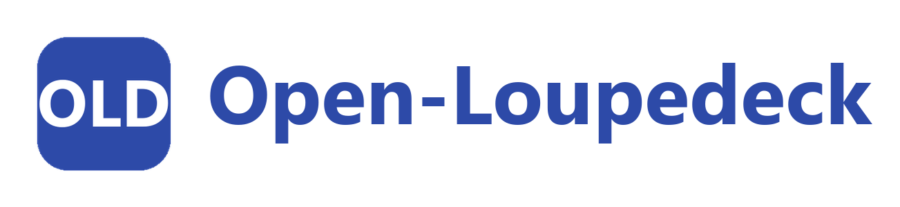

# Open-Loupedeck — Press Kit

Everything needed to write about, link to, or embed Open-Loupedeck somewhere else. If you need
something that isn't here (a different logo format, a real UI screenshot, a quote), open an issue
on the repo.

## One-liner

> Open-Loupedeck is a free, open-source background app that turns a Loupedeck Live / Live S into a
> fully custom control panel for OBS, Home Assistant, Spotify, Twitch, and more.

## Short description (~50 words)

Open-Loupedeck is an unofficial, open-source alternative to the stock Loupedeck software. It runs
quietly in the background and lets you bind every button, touch key, and knob on a Loupedeck Live
or Live S to real actions — switching OBS scenes, controlling Home Assistant devices, Spotify
playback, webhooks, sounds — with fully custom text, images, gradients, and animations on the keys.

## Longer description (~120 words)

Open-Loupedeck replaces the official Loupedeck software with a free, open-source alternative built
around one idea: every key should do exactly what you want, and look exactly how you want. It
connects to Loupedeck Live and Live S hardware over USB and turns presses, touches, and knob turns
into actions — OBS scene switching and audio control, Home Assistant device control and sensor
readouts, Spotify playback, Twitch live status, webhooks, local sounds, shell commands — configured
through a native window with live previews, drag-and-drop page management, undo/redo, and automatic
backups. Keys can show plain text, an icon, or a custom image, with gradients and both idle and
press animations. It installs like a normal app, runs in the system tray, and updates itself with
your confirmation.

## Key features

- **OBS Studio** — scene switching, mute toggle, volume control (WebSocket v5).
- **Home Assistant** — turn devices on/off/toggle, run scripts, call any service, show a sensor or
  the weather forecast on a key.
- **Spotify** — play/pause, skip, volume, jump to a specific playlist.
- **Twitch** — live/offline status, viewer count, uptime.
- **OBS browser overlay** — a transparent browser source that plays videos/GIFs/images/sounds on
  command.
- **HTTP / shell / system audio** — webhooks, local sound playback, shell commands, system volume.
- **Fully custom key graphics** — solid colors or gradients, continuous idle animations, one-shot
  press animations, custom fonts, icon packs (Simple Icons, Lucide, Heroicons, MDI), or your own
  images — all previewable before you press anything.
- **Pages** — unlimited pages, reordered by drag-and-drop.
- Runs as a background service with a tray icon and a native configuration window; installs and
  updates like a normal desktop app (Windows now, macOS/Linux packages available, not yet
  hardware-tested).

## Good to know before you write about it

This project is almost entirely **AI-assisted / "vibe-coded"** — built collaboratively with
[Claude Code](https://claude.com/claude-code) rather than hand-written line by line. It's tested
against real hardware and the source is public, but that context is worth including if you're
writing about it.

## License

[PolyForm Noncommercial 1.0.0](../LICENSE) — free to use, share, and modify; no commercial resale.
See [`THIRD_PARTY_NOTICES.md`](../THIRD_PARTY_NOTICES.md) for the licenses of bundled dependencies.

## Links

- Repository: <https://github.com/helldog136/open-loupedeck>
- Releases / downloads: <https://github.com/helldog136/open-loupedeck/releases>
- Author: [@helldog136](https://github.com/helldog136)

## Logo

  

| File | Use |
|---|---|
| [`logo/wordmark-transparent.png`](logo/wordmark-transparent.png) | Wordmark, transparent background — for dark or colored surfaces. |
| [`logo/wordmark-white.png`](logo/wordmark-white.png) | Wordmark, white background — for light surfaces / documents. |
| [`logo/icon-512.png`](logo/icon-512.png), [`icon-256.png`](logo/icon-256.png), [`icon-128.png`](logo/icon-128.png), [`icon-64.png`](logo/icon-64.png) | Icon only, square, transparent background, at common sizes. |

Please don't alter the icon's colors or proportions, and don't imply official endorsement by
Loupedeck / Logitech — this is an independent, unofficial project.
